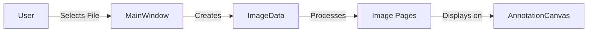
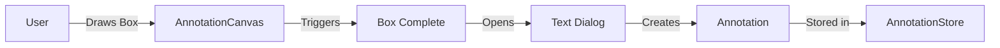
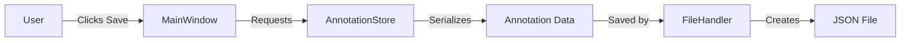

# LayoutLM Annotation Tool Documentation

## Overview
The LayoutLM Annotation Tool is a desktop application designed for annotating document images and creating labeled datasets for training LayoutLM models. It allows users to draw bounding boxes around specific elements in documents (like invoices) and associate them with predefined fields such as total amount, vendor name, dates, etc.

## Key Features
- Multi-page document support (PDF, TIFF, PNG, JPEG)
- Visual annotation with bounding boxes
- Field-specific color coding
- Annotation persistence
- Page navigation
- Real-time visualization of annotations

## Architecture

### Component Structure
```
layoutlm_annotation_tool/
├── __init__.py
├── config/
│   └── config.py           # Configuration settings
├── main.py                 # Application entry point
├── models/
│   ├── annotation.py       # Data structures for annotations
│   └── image_data.py       # Image handling
├── ui/
│   ├── canvas_widget.py    # Drawing surface
│   ├── control_panel.py    # UI controls
│   ├── dialogs.py         # Pop-up dialogs
│   └── main_window.py     # Main application window
└── utils/
    ├── file_handler.py     # File operations
    └── image_utils.py      # Image processing utilities
```

### Core Components

#### 1. Models
- **AnnotationStore**
  - Purpose: Central data repository for annotations
  - Manages annotation data per page and field
  - Handles serialization/deserialization
  
- **ImageData**
  - Manages document pages
  - Handles image loading and page navigation
  - Maintains current page state

#### 2. UI Components
- **MainWindow**
  - Main application container
  - Coordinates interactions between components
  - Manages the overall application state

- **AnnotationCanvas**
  - Handles drawing operations
  - Displays document images
  - Shows visual annotations
  - Manages user interactions for box drawing

- **ControlPanel**
  - Provides navigation controls
  - Field selection interface
  - Annotation list display
  - File operations buttons

#### 3. Utilities
- **FileHandler**
  - Manages saving/loading annotations
  - Handles file system operations
  - JSON serialization/deserialization

- **ImageUtils**
  - Image processing operations
  - Format conversions
  - Display preparation

### Data Flow

1. **Image Loading**


2. **Annotation Process**


3. **Saving Annotations**


### Interaction Patterns

1. **Field Selection**
- User selects field in ControlPanel
- MainWindow updates current field
- AnnotationCanvas updates visual styling
- Subsequent annotations are associated with selected field

2. **Page Navigation**
- User clicks navigation buttons
- ImageData updates current page
- MainWindow triggers display update
- AnnotationCanvas shows new page with its annotations

3. **Annotation Creation**
- User draws box on canvas
- Dialog prompts for text
- AnnotationStore creates new annotation
- Canvas updates visual display
- Control panel updates annotation list

### File Formats

1. **Annotation Storage**
```json
{
  "image_path": "path/to/document.pdf",
  "annotations": {
    "0": {  // Page number
      "total_amount": {  // Field name
        "box": [x1, y1, x2, y2],
        "text": "annotated text"
      }
    }
  }
}
```

2. **Configuration**
```python
DEFAULT_FIELDS = [
    'total_amount',
    'vendor_name',
    'invoice_date',
    'invoice_number',
    'address'
]

FIELD_COLORS = {
    'total_amount': '#FF6B6B',
    'vendor_name': '#4ECDC4',
    ...
}
```

### Error Handling
- File operations wrapped in try-except blocks
- User feedback via message boxes
- Debug logging for troubleshooting
- Graceful fallbacks for missing data

### Future Enhancements
1. Undo/redo functionality
2. Custom field definitions
3. Batch processing
4. Export formats for different ML frameworks
5. Annotation validation
6. Search and filter capabilities
7. Keyboard shortcuts
8. Annotation templates

## Usage Guidelines

1. **Starting the Application**
```python
python main.py
```

2. **Loading a Document**
- Click "Load Image"
- Select supported document file
- Navigate pages using arrow buttons

3. **Creating Annotations**
- Select field from right panel
- Draw box around target area
- Enter text in popup dialog
- Verify in annotation list

4. **Saving Work**
- Click "Save Annotations"
- JSON file created next to source document
- Annotations can be loaded later

## Development Guidelines

1. **Adding New Fields**
- Update DEFAULT_FIELDS in config.py
- Add corresponding color in FIELD_COLORS
- Update UI if needed

2. **Custom Annotation Types**
- Extend Annotation class
- Update AnnotationStore
- Modify canvas drawing logic

3. **New File Formats**
- Add format handler in FileHandler
- Update file type filters
- Implement conversion logic